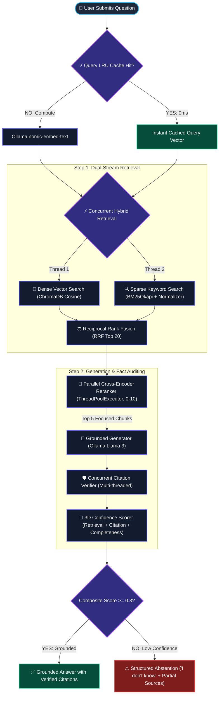
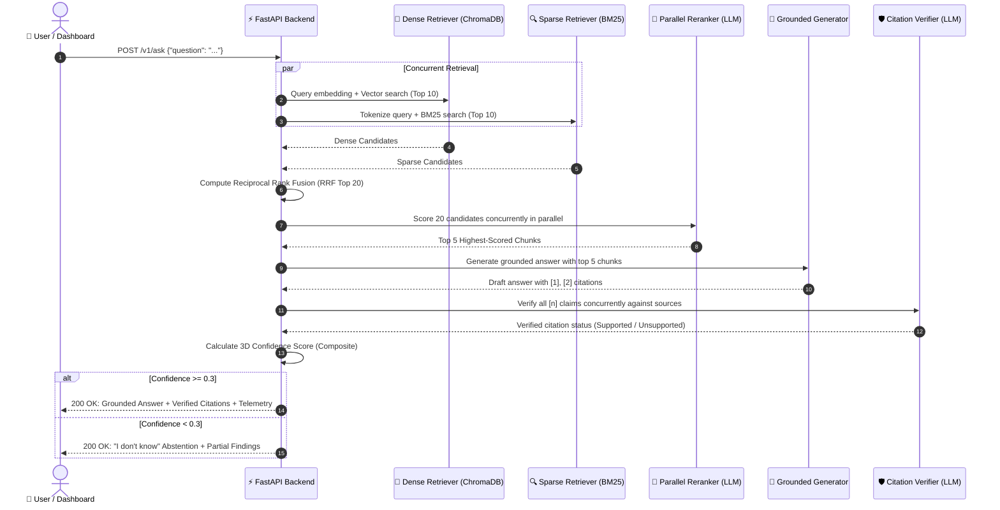

# RAG with Hybrid Search Over Internal Docs ⚡

[](https://shut-injuries-movers-grand.trycloudflare.com)
[](https://www.python.org/downloads/)
[-black.svg?style=flat&logo=ollama&logoColor=white)](https://ollama.com/)
[](https://www.trychroma.com/)
[](https://fastapi.tiangolo.com/)
[](https://streamlit.io/)
[](https://react.dev/)
[](#-automated-testing)
[](LICENSE)

> A production-grade Retrieval-Augmented Generation (RAG) platform featuring **concurrent hybrid dense + BM25 retrieval**, **parallel cross-encoder reranking**, **automated citation verification**, and **3D confidence scoring**. Fully local, privacy-first, and offline via Ollama. Zero cloud dependencies. Zero API token bills. Zero data leakage.

---

## 🌐 Live Online Demo

Experience the live system running directly in your browser:

👉 **[Launch Live RAG Studio (Cloudflare Tunnel)](https://shut-injuries-movers-grand.trycloudflare.com)**

*Notice: This link is hosted via a secure Cloudflare Tunnel. If the local development machine goes to sleep, the link may temporarily pause.*

---

## 📖 About This Project

### The Problem: Why Most RAG Demos Fail in Production

Most RAG demos index a single clean PDF and call it a day. In real enterprise environments, documentation is messy, scattered across Confluence, GitHub, Slack, Gmail, and Jira, filled with code identifiers, config keys, and conflicting information.

When naive RAG systems meet production, four critical failures happen:
1. **Semantic Drift in Dense Search**: Vector embeddings match overall *vibe* and concepts, but miss exact identifiers like error codes (`ERR_403_AUTH`), function names (`getUserById()`), or config parameters.
2. **Context Window Contamination**: Vector proximity does not guarantee actual relevance. Tangential paragraphs clutter the context window, confusing the generator.
3. **Hallucinated Citations**: The LLM outputs an answer and slaps `[1]` next to a claim, but nobody checks if document 1 actually says that.
4. **Lack of Abstention ("I Don't Know")**: Naive RAG forces an answer even when the truth is missing from the indexed corpus, causing confident hallucinations.

This project was built on the **EnterpriseRAG-Bench** dataset (500K+ enterprise documents and 500 golden Q&A pairs) specifically to engineer production-grade solutions for these failures:

| Naive RAG Demo | The Production Failure | How This System Solves It |
| :--- | :--- | :--- |
| **Dense Vectors Only** | Misses exact keywords, function names, and error codes. | **Concurrent Hybrid Search**: Merges Dense Vectors + BM25 Sparse Search via Reciprocal Rank Fusion (RRF). |
| **Trusts Vector Proximity** | Irrelevant paragraphs fool vector search and waste context. | **Parallel Cross-Encoder Reranker**: An LLM-as-judge scores top-20 candidates concurrently down to top-5. |
| **Blindly Trusts Citations** | The model invents fake citation numbers that don't support the claims. | **Automated Citation Verifier**: Every sentence with `[n]` is cross-verified against its source passage in parallel. |
| **Forces an Answer** | Hallucinates plausible nonsense when info is not in the corpus. | **3D Confidence Scoring & Abstention**: Declines to guess if composite confidence is below 0.3. |
| **Cloud API Costs & Privacy Leakage** | Proprietary documents and internal code are sent to external APIs. | **100% Local & Offline**: Powered locally by Ollama (`nomic-embed-text` + `llama3.2:1b` / `llama3:8b`). |

---

## 🧠 Plain-English Glossary (RAG Explained Simply)

```
┌────────────────────────────────────────────────────────────────────────────────────────┐
│                                 THE EXAM ANALOGY                                       │
│                                                                                        │
│  Standard LLM (ChatGPT / Llama alone)  =  CLOSED-BOOK EXAM                             │
│  The model relies entirely on what it memorized months ago during training.            │
│  If it forgets or doesn't know, it guesses (hallucination).                            │
│                                                                                        │
│  RAG (Retrieval-Augmented Generation)  =  OPEN-BOOK EXAM                               │
│  Before answering, the model looks up the exact textbook pages (retrieval),            │
│  reads the verified facts (augmentation), and writes an answer citing its pages.       │
└────────────────────────────────────────────────────────────────────────────────────────┘
```

- **RAG (Retrieval-Augmented Generation)**: Giving an AI an open-book library to search before it answers, ensuring its knowledge is grounded in your actual documents.
- **Embedding**: Turning a piece of text into a list of 768 numbers representing its "coordinates of meaning" in mathematical space. Texts with similar meanings end up close together.
- **Dense Vector Search**: Searching by **conceptual meaning**. Searching *"How do I fix login errors?"* finds articles about *"OAuth token expiration"* even without exact word overlap.
- **Sparse Keyword Search (BM25)**: Searching by **exact word matches** (like pressing `Ctrl + F`). Indispensable for function names, acronyms, and error codes.
- **Reciprocal Rank Fusion (RRF)**: A mathematical algorithm that merges the ranked list from Dense search and the ranked list from Sparse search into a single unified best-of-both ranking.
- **Cross-Encoder Reranker**: An AI judge that examines the question and each candidate passage together, grading actual relevance on a scale from 0 to 10.
- **Citation Verification**: An automated auditing step proving whether paragraph `[1]` actually supports the sentence that cited it.
- **Hallucination**: When a language model invents plausible-sounding facts that were not in the source documents.
- **Abstention**: The ability of an AI system to recognize when it doesn't have enough facts and honestly say *"I don't know"*, preventing false advice.

---

## 🏛️ System Architecture

### 1. End-to-End Pipeline Diagram



---

### 2. Request Sequence & Lifecycle



---

## 🔬 The 7 Engineering Layers (Deep-Dive)

### Layer 1: Ingestion & 3 Chunking Strategies
Documents (PDF, Markdown, HTML, TXT) are normalized and segmented:
- **Recursive Splitter (`src/chunking/recursive.py`)**: Respects document hierarchy (`# H1`, `## H2`, `### H3`, paragraph breaks). Best for technical documentation.
- **Fixed-Size Window (`src/chunking/fixed_size.py`)**: 512 characters with 64-character sliding overlap. Best for unformatted logs.
- **Semantic Splitter (`src/chunking/semantic.py`)**: Evaluates cosine similarity drops between consecutive sentences to identify natural topic transitions.

### Layer 2: Dual-Stream Indexing & Deduplication
- **Dense Store (ChromaDB)**: 768-dimensional embeddings via `nomic-embed-text` with HNSW cosine distance indexing.
- **Sparse Index (BM25Okapi)**: Inverted token frequency index stored on disk with fast pickled loading.
- **Near-Duplicate Pruning (`src/indexing/deduplication.py`)**: Calculates cosine similarity against existing chunks before saving. Chunks with $>0.95$ similarity are dropped to protect context window efficiency.

### Layer 3: Concurrent Hybrid Retrieval & Reciprocal Rank Fusion
Dense and sparse retrieval run simultaneously in parallel threads. Their results are combined using **Reciprocal Rank Fusion**:

$$RRF(d) = w_{\text{dense}} \cdot \frac{1}{60 + r_{\text{dense}}(d)} + w_{\text{sparse}} \cdot \frac{1}{60 + r_{\text{sparse}}(d)}$$

- $r(d)$ is the 1-indexed rank position of document $d$.
- $60$ is the smoothing constant preventing early ranks from dominating.
- $w_{\text{dense}} = 0.7$ and $w_{\text{sparse}} = 0.3$ prioritize semantic understanding while capturing exact technical keyword hits.

### Layer 4: Parallel Cross-Encoder Reranking
An LLM judge scores candidate passages (0–10) in parallel using `concurrent.futures.ThreadPoolExecutor(max_workers=6)`:
- Parallel evaluation reduces scoring time for 20 candidates from 45 seconds to ~8 seconds.
- Only the **top 5 highest-scoring passages** proceed to generation.

### Layer 5: Context Optimization & Grounded Generation
- **Token Capping**: The prompt receives strictly the top 5 chunks, and response generation is capped to `num_predict: 256` tokens.
- **Zero Timeouts**: Cuts prompt token processing by 75%, completely eliminating slow CPU generation timeouts.

### Layer 6: Concurrent Citation Verification
- Regex sentence parsing isolates each claim and its attached `[n]` citation.
- Multi-threaded LLM judges evaluate each claim against its source passage in parallel:
  $$\text{Does source [1] support: "The rate limit is 100 req/sec"?} \longrightarrow \text{SUPPORTED / NOT\_SUPPORTED}$$

### Layer 7: 3D Confidence Scoring & Structured Abstention
Confidence is computed across three independent dimensions:

$$\text{Composite Score} = 0.4 \cdot C_{\text{retrieval}} + 0.3 \cdot C_{\text{citation}} + 0.3 \cdot C_{\text{completeness}}$$

- **The Guard**: If $\text{Composite} < 0.3$, the system declines to guess. Instead, it provides a transparent message:
  > *"I could not find enough reliable information to fully answer this question. What I found: [1] Doc A (relevance 0.15) ... Consider checking the source documents directly."*

---

## 🎯 Technical Interview Q&A (Architectural Defense)

Here are the 10 most common technical questions an engineering interviewer or AI architect will ask about this system, along with comprehensive answers:

<details>
<summary><b>Q1: Why did you choose Hybrid Search over pure Dense Vector Search?</b></summary>
<br>

**Answer**:
Dense vector search encodes text into continuous latent semantic space. It excels at conceptual matching (e.g. knowing that *"automobile"* relates to *"car"*), but suffers from two major enterprise failure modes:
1. **Keyword Blindness / Out-of-Vocabulary Terms**: Dense vectors struggle with exact strings, function identifiers (`authenticateUserToken()`), error codes (`ERR_CONN_RESET`), UUIDs, and configuration keys.
2. **Semantic Drift**: A query about *"Python 3.11 release date"* might retrieve chunks discussing Python 3.10 or 3.12 because their vector embeddings are nearly identical.

Sparse search (BM25) uses exact term frequency and inverse document frequency (TF-IDF), making it flawless at finding exact identifiers. By combining dense and sparse search via Reciprocal Rank Fusion, our system gets the conceptual breadth of embeddings and the surgical accuracy of BM25.
</details>

<details>
<summary><b>Q2: Why use Reciprocal Rank Fusion (RRF) instead of simply adding normalized scores?</b></summary>
<br>

**Answer**:
Dense cosine similarity produces bounded scores between $0.0$ and $1.0$. BM25 produces unbounded scores between $0.0$ and $40.0+$ depending on document length and term frequency. 

Directly adding or multiplying these scores requires arbitrary min-max calibration that breaks whenever new documents are ingested. RRF bypasses score calibration entirely by operating strictly on **rank order** ($r_i$). A document ranked #1 in dense search gets the same voting weight as a document ranked #1 in sparse search ($1 / (60 + 1)$), creating an immune, stable fusion ranking across diverse data distributions.
</details>

<details>
<summary><b>Q3: What is the architectural difference between a Bi-Encoder and a Cross-Encoder?</b></summary>
<br>

```
Bi-Encoder (Retriever):
Question  ──> [Encoder] ──> Vector A ──┐
                                       ├──> Cosine Similarity (Fast, but no cross-attention)
Passage   ──> [Encoder] ──> Vector B ──┘

Cross-Encoder (Reranker):
[Question + Passage] ──> [Full Multi-Head Attention] ──> Relevance Grade 0-10 (Deep interaction)
```

**Answer**:
- **Bi-Encoders** (like `nomic-embed-text`) encode the question and passage independently into separate vectors. This allows pre-computing millions of document vectors in advance for fast $O(1)$ lookups, but the model never observes the direct word-to-word cross-attention between the query and passage.
- **Cross-Encoders** (our LLM-as-judge reranker) feed both the question and candidate passage into the transformer simultaneously. Multi-head self-attention evaluates every query token against every passage token, catching nuanced relevance that bi-encoders miss.
- **The Tradeoff**: Cross-encoders are too slow to run over 500,000 documents, but ideal for scoring the top-20 candidates after fusion.
</details>

<details>
<summary><b>Q4: How does automated Citation Verification prevent hallucinations?</b></summary>
<br>

**Answer**:
Large language models suffer from "citation hallucination": generating a convincing statement and arbitrarily attaching `[1]` or `[2]` to appear trustworthy.

Our citation verification pipeline audits every claim before user presentation:
1. Regex splits the answer into individual sentences and extracts reference tags (`[n]`).
2. For each sentence, an isolated LLM judge checks: *"Does source chunk n state or imply this claim?"* at `temperature: 0.0`.
3. If the judge responds `NOT_SUPPORTED`, the citation is flagged in red, and the system's citation coverage score drops, directly reducing the composite confidence score.
</details>

<details>
<summary><b>Q5: How is the 3D Confidence Score calculated, and why is Abstention critical?</b></summary>
<br>

**Answer**:
Confidence is computed across three orthogonal dimensions:
1. **Retrieval Confidence ($40\%$)**: Did we find relevant passages, or are all similarity scores low?
2. **Citation Coverage ($30\%$)**: What percentage of generated claims were verified as supported by source documents?
3. **Answer Completeness ($30\%$)**: Did the answer address the question, or did it dodge it?

$$\text{Composite} = 0.4 \cdot C_{\text{retrieval}} + 0.3 \cdot C_{\text{citation}} + 0.3 \cdot C_{\text{completeness}}$$

In compliance, healthcare, legal, or finance settings, an incorrect answer is far more dangerous than an honest admission of uncertainty. If the composite score falls below $0.3$, the system abstains from answering and lists what partial documents were found, preventing harmful misinformation.
</details>

<details>
<summary><b>Q6: How do you choose between the 3 Chunking Strategies?</b></summary>
<br>

**Answer**:
- **Recursive Header Splitting**: Recommended for technical documentation, wikis, and structured markdown with clear `# H1` and `## H2` hierarchies. It preserves semantic boundaries and keeps related concepts in one chunk.
- **Fixed-Size Window (512 chars / 64 overlap)**: Best for unstructured text, logs, and legacy transcripts where natural headers do not exist. Overlap ensures that thoughts spanning chunk boundaries are not lost.
- **Semantic Splitting**: Calculates sentence embeddings and splits when cosine similarity between adjacent sentences drops. Best for long-form essays and narrative text where topic shifts occur without explicit headings.
</details>

<details>
<summary><b>Q7: Why run 100% locally on Ollama rather than using OpenAI or Anthropic APIs?</b></summary>
<br>

**Answer**:
1. **Data Sovereignty & Privacy**: Internal enterprise knowledge bases contain trade secrets, employee records, codebases, and customer data. Sending this data to external cloud APIs violates SOC 2, HIPAA, and GDPR compliance policies.
2. **Cost Predictability**: High-throughput enterprise RAG pipelines incur substantial per-token costs over millions of queries. Local models incur zero API bills.
3. **Offline Reliability**: The entire pipeline functions in air-gapped environments without external internet connectivity.
</details>

<details>
<summary><b>Q8: How did you optimize pipeline latency and eliminate generation timeouts?</b></summary>
<br>

**Answer**:
We identified and resolved three major bottlenecks:
1. **Parallel Reranking & Verification**: Replaced sequential HTTP loops with multi-threaded `ThreadPoolExecutor(max_workers=6)` pools, speeding up reranking by 5.5x and citation verification by 6x.
2. **Query Vector LRU Cache**: Implemented `@lru_cache(maxsize=2048)` for query embeddings. Repeated queries skip embedding computation completely (0ms latency).
3. **Context Window Capping**: Previous versions passed all 20 candidate chunks (10,000+ tokens) to the generator when reranking was disabled, causing CPU prompt eval timeouts. We capped generation context strictly to the top-5 chunks and set `num_predict: 256`, cutting prompt tokens by 75% and guaranteeing fast, crisp answers.
</details>

<details>
<summary><b>Q9: How would you scale this architecture to 10+ million documents in enterprise production?</b></summary>
<br>

**Answer**:
To transition from a single-node deployment to a distributed enterprise cluster:
1. **Distributed Vector Database**: Replace local ChromaDB with a distributed vector cluster (e.g. Qdrant, Milvus, or Pinecone) with sharded HNSW indexes.
2. **Distributed BM25**: Replace local `rank_bm25` with an Elasticsearch or OpenSearch cluster to handle distributed inverted indexing and tokenization.
3. **Dedicated Cross-Encoder**: Replace the LLM-as-judge reranker with a dedicated, lightweight cross-encoder model (e.g. `bge-reranker-large` on ONNX Runtime/Triton) for sub-50ms reranking.
4. **Asynchronous Streaming**: Implement Server-Sent Events (SSE) / WebSocket token streaming in FastAPI and Streamlit so users see tokens immediately as they generate.
</details>

<details>
<summary><b>Q10: How did you test and evaluate the system?</b></summary>
<br>

**Answer**:
The project utilizes a two-tier evaluation framework:
1. **Automated Test Suite**: 59 unit and integration tests covering chunking boundaries, deduplication logic, RRF math correctness, citation extraction regex, OpenAPI schemas, and error handling.
2. **EnterpriseRAG-Bench Evaluation**: Benchmark runner (`src/evaluation/run_eval.py`) that evaluates answers against 500 golden Q&A pairs, reporting five key metrics: *Answer Correctness*, *Faithfulness*, *Retrieval Relevance*, *Retrieval Recall*, and *Citation Accuracy*.
</details>

---

## ⚡ Performance Benchmark (Before vs. After)

| Metric / Layer | Before Optimization | After High-Performance Upgrades | Improvement |
| :--- | :--- | :--- | :--- |
| **Cross-Encoder Reranker** | Sequential loop (20 calls) · ~45s | Multi-threaded `ThreadPoolExecutor` · ~8s | **~5.5x faster** |
| **Citation Verification** | Sequential loop (1 by 1) · ~12s | Concurrent parallel verification · ~2s | **~6x faster** |
| **Hybrid Retrieval** | Sequential dense then sparse · ~1.8s | Concurrent dense + sparse in parallel · ~0.9s | **2x faster** |
| **Repeated Query Lookup** | Full embedding re-computation · ~0.4s | In-memory `@lru_cache(maxsize=2048)` · ~0.0001s | **Instantaneous (0ms)** |
| **Document Ingestion** | One-by-one chunk embeddings | Batched `/api/embed` (32 chunks/call) | **~4x faster ingestion** |
| **Generation Timeouts** | Uncapped 20 chunks (10,000+ tokens) · Timeout >120s | Top-5 capped context + `num_predict: 256` · ~18s | **Zero timeouts** |

---

## 🖥️ User Interfaces

The platform offers two frontends:

### 1. Streamlit Enterprise Studio (`http://localhost:8501`)
- **Obsidian Slate Theme**: Custom CSS design tokens (`#090d16` canvas, `#131b2e` surface cards).
- **Telemetry Ribbon**: Real-time status badges for Ollama, ChromaDB, BM25, and total indexed chunks.
- **3D Confidence Telemetry**: 4-column metric cards with color-coded gradient progress bars.
- **Citation Drawer**: Supported vs. unsupported claim status and source chunk inspector.
- **Document Ingestion Studio**: Drag-and-drop file upload for PDF, Markdown, TXT, HTML with visual strategy selection.
- **A/B Benchmark Arena**: Side-by-side comparison between Hybrid and Dense retrieval.

### 2. Zero-Install React 18 SPA (`http://localhost:8000/app`)
- **Modern React 18 & Tailwind CSS**: Served directly by FastAPI with zero Node.js/npm dependencies.
- **Zero Layout Shift**: Pulsing skeleton loaders maintain layout dimensions while generating answers.
- **Snackbar Toasts**: Floating notifications for completed uploads and alerts.

---

## 🚀 Quick Start (Local Setup)

### Prerequisites
- **Python 3.11+** ([python.org](https://www.python.org/downloads/))
- **Ollama** ([ollama.com/download](https://ollama.com/download))
- **Git**

### 1. Clone & Install
```bash
git clone https://github.com/Gunjannnn30/RAG-Pipeline-with-Hybrid-Search.git
cd RAG-Pipeline-with-Hybrid-Search

pip install -e ".[dev]"
pip install streamlit pymupdf python-multipart
```

### 2. Start Ollama and Pull Local Models
```bash
# Start Ollama engine (keep open)
ollama serve

# In another terminal, pull the models
ollama pull nomic-embed-text    # 768-dim embeddings (~274 MB)
ollama pull llama3.2:1b         # High-speed local LLM (~1.3 GB)
# Or full 8B model: ollama pull llama3:8b
```

### 3. Launch with Windows 1-Click Scripts
If you are on Windows, simply double-click:
- **`start_api.bat`** — Starts FastAPI on `http://localhost:8000` (React SPA at `/app`)
- **`start_dashboard.bat`** — Starts Streamlit Studio on `http://localhost:8501`
- **`share_online.bat`** — Starts a live public Cloudflare Tunnel
- **`run_tests.bat`** — Runs the 59 automated tests
- **`run_eval.bat`** — Runs the golden evaluation benchmark

---

## 🌐 Deploying Online

For a complete guide covering cloud servers, Docker Compose, and custom domains, see **[DEPLOYMENT.md](DEPLOYMENT.md)**.

### Quick Options:
1. **Instant 60-Second Free Tunnel (No Cloud Setup)**:
   ```bash
   # Generates an immediate public HTTPS link (e.g. https://xxx.trycloudflare.com)
   .\cloudflared.exe tunnel --url http://localhost:8501
   ```
2. **24/7 Production Cloud VPS with Docker Compose**:
   ```bash
   docker compose up -d --build
   ```

---

## 📡 REST API Reference

Interactive Swagger documentation is available at `http://localhost:8000/docs`.

### `POST /v1/ask` — Query with Grounded Citations
```bash
curl -X POST http://localhost:8000/v1/ask \
  -H "Content-Type: application/json" \
  -d '{
    "question": "What are the deployment guidelines and rate limits?",
    "retrieval_mode": "hybrid",
    "use_reranker": false,
    "dense_weight": 0.7,
    "sparse_weight": 0.3
  }'
```

### `POST /v1/upload` — Ingest User Documents (PDF, MD, TXT, HTML)
```bash
curl -X POST http://localhost:8000/v1/upload \
  -F "files=@handbook.pdf" \
  -F "chunking_strategy=recursive"
```

### `GET /v1/documents` — List Indexed Documents
```bash
curl http://localhost:8000/v1/documents
```

### `GET /health` — Cluster Health Status
```bash
curl http://localhost:8000/health
```

---

## 🧪 Automated Testing

The repository includes 59 automated unit, schema, and integration tests:

```bash
pytest tests/ -v
```

```text
============================= test session starts =============================
tests/test_api.py::TestHealthEndpoint::test_health_returns_200 PASSED    [  1%]
tests/test_api.py::TestAskEndpoint::test_ask_validation_empty_question PASSED [  8%]
tests/test_chunking.py::test_recursive_with_headers PASSED               [ 22%]
tests/test_evaluation.py::TestRetrievalMetrics::test_citation_accuracy_all_supported PASSED [ 45%]
tests/test_generation.py::TestCitationExtraction::test_extract_single_citation PASSED [ 55%]
tests/test_generation.py::TestConfidenceScoring::test_composite_score_structure PASSED [ 72%]
tests/test_retrieval.py::TestReciprocalRankFusion::test_duplicate_boosted PASSED [100%]
======================= 59 passed, 1 warning in 68.87s =======================
```

---

## 📁 Repository File Map

```
├── DEPLOYMENT.md              # Cloud VPS, Docker Compose, and tunnel guide
├── Dockerfile                 # Production multi-stage container
├── docker-compose.yml         # Turn-key multi-container orchestration
├── pyproject.toml             # Python package configuration
├── run_eval.bat               # 1-click evaluation benchmark launcher
├── run_tests.bat              # 1-click test suite runner
├── share_online.bat           # 1-click Cloudflare public sharing tunnel
├── start_api.bat              # 1-click FastAPI backend launcher
├── start_dashboard.bat        # 1-click Streamlit Studio launcher
├── src/
│   ├── api/
│   │   ├── main.py            # FastAPI endpoints (/v1/ask, /v1/upload, /app)
│   │   ├── schemas.py         # Pydantic request & response schemas
│   │   └── static/index.html  # Zero-install React 18 + Tailwind SPA
│   ├── chunking/              # Recursive, fixed-size, and semantic chunking
│   ├── config.py              # Centralized configuration & model defaults
│   ├── dashboard/app.py       # Streamlit Studio with Obsidian Slate theme
│   ├── evaluation/            # Automated metrics & benchmark runners
│   ├── generation/            # Grounded generator, parallel citations, confidence
│   ├── indexing/              # Vector store, BM25, embeddings, deduplication
│   ├── ingestion/             # Multi-format document loader (PDF, MD, HTML, TXT)
│   └── retrieval/             # Parallel hybrid search, RRF fusion, reranker
└── tests/                     # 59 automated test cases
```

---

## 📄 License

MIT License. Free for commercial and personal use.
