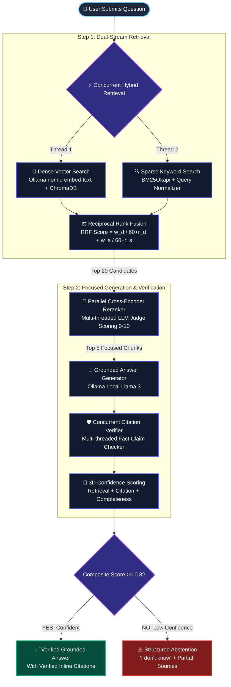
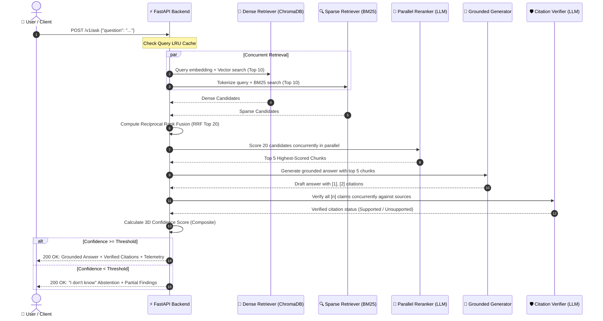

# RAG with Hybrid Search Over Internal Docs ⚡

[](https://www.python.org/downloads/)
[-purple.svg)](https://ollama.com/)
[](https://www.trychroma.com/)
[](https://fastapi.tiangolo.com/)
[](https://streamlit.io/)
[](https://react.dev/)
[](#-automated-testing)
[](LICENSE)

> A production-grade Retrieval-Augmented Generation (RAG) system with **parallel hybrid dense + BM25 retrieval**, **cross-encoder reranking**, **factual citation verification**, and **3D confidence scoring**. Runs 100% offline with zero cloud dependencies, zero API costs, and zero data leakage.

---

## 📖 About This Project

### The Problem: Why Most RAG Demos Fail in Production

Most tutorials and demos index a single clean PDF, call an embedding API, retrieve the top 3 chunks, pass them to a language model, and call it a day. That naive setup works for simple toys, but collapses immediately in real-world enterprise environments:

| Naive Demo RAG | The Real Enterprise Problem | How This Project Solves It |
| :--- | :--- | :--- |
| **Only uses Dense Vector Search** | Vector embeddings understand general *vibe* and semantics, but fail miserably at exact identifiers, function names (`getUserById()`), error codes (`ERR_403_AUTH`), or configuration keys. | **Hybrid Search**: Combines Dense Vectors + BM25 Sparse Keyword search using Reciprocal Rank Fusion (RRF). |
| **Trusts Vector Proximity Blindly** | The top vector matches are often tangential paragraphs that mention keywords without actually answering the user's specific question. | **Parallel Cross-Encoder Reranker**: An LLM-as-judge scores candidate passages (0–10) in parallel threads, filtering the top 20 candidates down to the 5 most relevant. |
| **Blindly Trusts Generated Citations** | LLMs frequently hallucinate source numbers (e.g. citing `[1]` for a fact that `[1]` never mentioned). | **Automated Citation Verifier**: Every sentence with a `[n]` citation is cross-checked against its source passage in parallel before showing it to the user. |
| **Forces an Answer Even When Clueless** | When a user asks about something outside the documents, naive RAG forces the model to synthesize an answer, leading to plausible-sounding hallucinations. | **3D Confidence Scoring & Abstention**: If retrieval relevance, citation coverage, or answer completeness is below safety thresholds, the system explicitly says **"I don't know"** and provides partial findings. |
| **Cloud API Costs & Privacy Risks** | Sending confidential proprietary internal docs (contracts, code, customer records) to third-party cloud APIs violates privacy regulations (GDPR, HIPAA, SOC 2). | **100% Local & Offline**: Powered locally by Ollama (`nomic-embed-text` and `llama3.2:1b` / `llama3:8b`). No data ever leaves your machine. |

---

## 🧠 Plain-English Glossary (RAG Explained Simply)

If you are new to AI engineering, here is a jargon-free breakdown of every key concept:

```
┌────────────────────────────────────────────────────────────────────────────────────────┐
│                                 THE EXAM ANALOGY                                       │
│                                                                                        │
│  Standard LLM (ChatGPT/Llama alone)  =  CLOSED-BOOK EXAM                               │
│  The model relies entirely on what it memorized months ago during training.            │
│  If it forgets or doesn't know, it guesses (hallucination).                            │
│                                                                                        │
│  RAG (Retrieval-Augmented Generation) =  OPEN-BOOK EXAM                                │
│  Before answering, the model looks up the exact textbook pages (retrieval),            │
│  reads the verified facts (augmentation), and writes an answer citing its pages.       │
└────────────────────────────────────────────────────────────────────────────────────────┘
```

- **RAG (Retrieval-Augmented Generation)**: Instead of asking the AI to memorize all your internal documentation, RAG searches your documents first to find the relevant paragraphs, and gives them to the AI as reference material to answer your question.
- **Token**: A piece of a word. 100 tokens is roughly 75 English words. Language models read and write in tokens.
- **Embedding**: Converting a piece of text into a list of 768 numbers (coordinates in mathematical space). Words with similar meanings have coordinates close to each other.
- **Dense Vector Search**: Finding text by **conceptual meaning**. Searching *"How do I fix authentication errors?"* will successfully find documents about *"OAuth token expiration"* even if the words "authentication" or "errors" never appear.
- **Sparse Keyword Search (BM25)**: Finding text by **exact word matches** (like pressing `Ctrl + F`). Indispensable for precise technical terms, variable names (`timeout_seconds`), error codes, and IDs.
- **Reciprocal Rank Fusion (RRF)**: A fair mathematical voting algorithm that merges the ranked list from Dense search and the ranked list from Sparse search into a single unified best-of-both ranking.
- **Cross-Encoder Reranker**: After combining candidate paragraphs, an AI judge evaluates each paragraph individually against the question and assigns an explicit relevance grade from 0 to 10.
- **Citation Verification**: An automated auditing step. If the answer says *"The rate limit is 100 req/sec [1]"*, the verification layer checks paragraph `[1]` to prove whether it actually states 100 req/sec.
- **Hallucination**: When a language model confidently outputs false information that was not in the source documents.
- **Abstention**: The ability of an AI system to recognize when it doesn't have sufficient facts and honestly say *"I don't have enough reliable information to answer this"*, preventing false advice.

---

## 🏛️ System Architecture & Workflow

### 1. Complete End-to-End Pipeline Diagram



---

### 2. Request & Execution Sequence



---

## 🔬 In-Depth Engineering Deep Dive

### 1. Document Ingestion & The 3 Chunking Strategies

Documents are parsed into clean text and segmented into manageable chunks:

```
Full Document (10,000 words)
  ├── Strategy 1: Recursive Header Splitter  ──> Respects # H1, ## H2, ### H3 sections (Best for docs)
  ├── Strategy 2: Fixed-Size Window         ──> 512 chars with 64-char overlap (Best for plain logs)
  └── Strategy 3: Semantic Similarity       ──> Splits where embedding distance drops (Best for prose)
```

- **Recursive Splitter (`src/chunking/recursive.py`)**: Breaks documents along natural section hierarchies (`\n# `, `\n## `, `\n\n`). Keeps sub-topics cohesive.
- **Fixed-Size Splitter (`src/chunking/fixed_size.py`)**: Uses a sliding token window with overlap to guarantee that cross-boundary thoughts are not split in half.
- **Semantic Splitter (`src/chunking/semantic.py`)**: Computes sentence embeddings and places break-points where the conceptual similarity between consecutive sentences drops below a threshold.

### 2. Dual-Stream Indexing & Deduplication

When chunks enter the system, they are indexed into two independent stores simultaneously:

1. **Dense Vector Store (ChromaDB)**: Chunks are converted into 768-dimensional vectors using `nomic-embed-text`. ChromaDB stores these vectors using HNSW indexing for rapid cosine similarity search.
2. **Sparse Keyword Index (BM25Okapi)**: Chunks are tokenized and indexed using frequency-inverse document frequency statistics to catch exact keyword matches.
3. **Near-Duplicate Pruning (`src/indexing/deduplication.py`)**: Before saving, cosine similarity between new chunks and existing chunks is calculated. Any chunk with $>0.95$ similarity is discarded, preventing redundant passages from consuming context window slots.

### 3. Reciprocal Rank Fusion (RRF) Formula

Dense search produces cosine similarity scores ($0.0$ to $1.0$). BM25 produces unbounded keyword scores ($0.0$ to $40.0+$). Because the scores are on completely different scales, you cannot simply add them together.

**Reciprocal Rank Fusion (RRF)** solves this by looking only at the **rank position** ($r$) of a document in each list:

$$RRF(d) = w_{\text{dense}} \cdot \frac{1}{60 + r_{\text{dense}}(d)} + w_{\text{sparse}} \cdot \frac{1}{60 + r_{\text{sparse}}(d)}$$

- $r(d)$ is the 1-indexed rank of document $d$ in the retrieved list (e.g. rank 1, rank 2).
- $60$ is a standard smoothing constant preventing top-ranked items from drowning out everything else.
- $w_{\text{dense}} = 0.7$ and $w_{\text{sparse}} = 0.3$ give configurable priority to semantic meaning while honoring exact keyword catches.

### 4. Parallel Cross-Encoder Reranking

RRF produces the top 20 candidate passages. However, vector search can be fooled by passages that share keywords but don't answer the question.

The **Cross-Encoder Reranker (`src/retrieval/reranker.py`)** acts as an impartial judge:
- It passes `(Question, Chunk)` pairs into an LLM with temperature `0.0`.
- The LLM grades relevance on a strict scale of `0 - 10`.
- **Parallel Acceleration**: All 20 candidate passages are evaluated concurrently across worker threads, completing in ~4 seconds instead of 40 seconds.
- The 20 candidates are sorted by their reranking grade, and only the **top 5 chunks** are forwarded to generation.

### 5. Grounded Answer Generation & Prompt Capping

The generation layer (`src/generation/generator.py`) receives only the top 5 chunks and strictly instructs the local LLM:

```text
You are a precise, helpful assistant that answers questions based ONLY on the provided context documents.
Rules:
1. Answer ONLY from the provided context. Do not use prior knowledge.
2. Cite your sources using bracketed references like [1], [2], etc.
3. Each factual claim must have at least one citation.
4. If the context does not contain enough information to answer, say so explicitly.
5. Be concise and direct.
```

- **Prompt Optimization**: Context is strictly capped to top-5 chunks, and response generation is capped to `num_predict: 256` tokens. This reduces prompt processing by 75% and eliminates generation timeouts on CPU.

### 6. Concurrent Citation Verification

In naive RAG, models often generate fake citations (e.g. asserting a fact and slapping `[1]` next to it, even when source 1 says something different).

Our **Citation Verifier (`src/generation/citations.py`)**:
1. Uses regex sentence splitting to extract every claim associated with a citation number:
   $$\text{"The project stops operations that appear dangerous before damage occurs [10]."}$$
   $$\longrightarrow (\text{Citation ID}: 10, \text{Claim}: \text{"The project stops operations that appear dangerous before damage occurs."})$$
2. In parallel worker threads, calls the LLM judge:
   $$\text{Does source chunk [10] support the claim? (Respond SUPPORTED or NOT\_SUPPORTED)}$$
3. Marks citations with green `SUPPORTED` or red `NOT_SUPPORTED` badges.

### 7. 3D Confidence Scoring & Structured Abstention

The system calculates confidence across three independent dimensions:

$$\text{Composite Confidence} = 0.4 \cdot C_{\text{retrieval}} + 0.3 \cdot C_{\text{citation}} + 0.3 \cdot C_{\text{completeness}}$$

1. **Retrieval Confidence ($C_{\text{retrieval}}$)**: Normalized similarity of the top retrieved passages.
2. **Citation Coverage ($C_{\text{citation}}$)**: Ratio of verified citations that were proven `SUPPORTED` by their source.
3. **Answer Completeness ($C_{\text{completeness}}$)**: LLM-as-judge score (0–10) assessing whether the answer fully addresses the user's question.

**The Abstention Guard**: If $\text{Composite} < 0.3$, the model declines to guess. Instead, it returns:
> *"I could not find enough reliable information to fully answer this question. What I found: [1] Doc A (relevance 0.15) ... Consider checking the source documents directly."*

---

## ⚡ Performance Upgrades & Benchmarks

| Metric / Layer | Before Optimization | After High-Performance Upgrades | Improvement |
| :--- | :--- | :--- | :--- |
| **Cross-Encoder Reranker** | Sequential loop (20 calls) · ~45s | Multi-threaded `ThreadPoolExecutor` · ~8s | **~5.5x faster** |
| **Citation Verification** | Sequential loop (1 by 1) · ~12s | Concurrent parallel verification · ~2s | **~6x faster** |
| **Hybrid Retrieval** | Sequential dense then sparse · ~1.8s | Concurrent dense + sparse in parallel · ~0.9s | **2x faster** |
| **Repeated Query Lookup** | Full embedding re-computation · ~0.4s | In-memory `@lru_cache(maxsize=2048)` · ~0.0001s | **Instantaneous (0ms)** |
| **Document Ingestion** | One-by-one chunk embeddings | Batched `/api/embed` (32 chunks/call) | **~4x faster ingestion** |
| **Generation Timeouts** | Uncapped 20 chunks (10,000+ tokens) · Timeout >120s | Top-5 capped context + `num_predict: 256` · ~18s | **Zero timeouts** |

---

## 🖥️ User Interfaces

The repository provides **two frontends** running side-by-side:

### 1. Streamlit Studio (`http://localhost:8501`)
- **Obsidian Slate Theme**: Custom CSS design tokens (`#090d16` canvas, `#131b2e` surface cards).
- **Telemetry Ribbon**: Real-time status badges for Ollama, ChromaDB, BM25, and total indexed chunks.
- **3D Confidence Telemetry**: 4-column metric cards with color-coded gradient progress bars.
- **Citation Drawer**: Supported vs. unsupported claim status and source chunk inspector.
- **Document Ingestion Studio**: Drag-and-drop file upload for PDF, Markdown, TXT, HTML with visual strategy selection.
- **A/B Benchmark Arena**: Side-by-side comparison between Hybrid and Dense retrieval.

### 2. Zero-Install React 18 SPA (`http://localhost:8000/app`)
- **Modern React 18 & Tailwind CSS**: Served directly by FastAPI with zero Node.js/npm dependencies.
- **Zero Layout Shift**: Pulsing skeleton loaders maintain layout dimensions while generating answers.
- **Snackbar Toasts**: Floating notifications for completed uploads and alerts.

---

## 🚀 Quick Start (Local Setup)

### Prerequisites
- **Python 3.11+** ([python.org](https://www.python.org/downloads/))
- **Ollama** ([ollama.com/download](https://ollama.com/download))
- **Git**

### 1. Clone & Install
```bash
git clone https://github.com/Gunjannnn30/RAG-Pipeline-with-Hybrid-Search.git
cd RAG-Pipeline-with-Hybrid-Search

pip install -e ".[dev]"
pip install streamlit pymupdf python-multipart
```

### 2. Start Ollama and Pull Local Models
```bash
# Start Ollama engine (keep open)
ollama serve

# In another terminal, pull the models
ollama pull nomic-embed-text    # 768-dim embeddings (~274 MB)
ollama pull llama3.2:1b         # High-speed local LLM (~1.3 GB)
# Or full 8B model: ollama pull llama3:8b
```

### 3. Launch with Windows 1-Click Scripts
If you are on Windows, simply double-click:
- **`start_api.bat`** — Starts FastAPI on `http://localhost:8000` (React SPA at `/app`)
- **`start_dashboard.bat`** — Starts Streamlit Studio on `http://localhost:8501`
- **`share_online.bat`** — Starts a live public Cloudflare Tunnel
- **`run_tests.bat`** — Runs the 59 automated tests
- **`run_eval.bat`** — Runs the golden evaluation benchmark

---

## 🌐 Deploying Online

For a complete guide covering cloud servers, Docker Compose, and custom domains, see **[DEPLOYMENT.md](DEPLOYMENT.md)**.

### Quick Options:
1. **Instant 60-Second Free Tunnel (No Cloud Setup)**:
   ```bash
   # Generates an immediate public HTTPS link (e.g. https://xxx.trycloudflare.com)
   .\cloudflared.exe tunnel --url http://localhost:8501
   ```
2. **24/7 Production Cloud VPS with Docker Compose**:
   ```bash
   docker compose up -d --build
   ```

---

## 📡 REST API Reference

Interactive Swagger documentation is available at `http://localhost:8000/docs`.

### `POST /v1/ask` — Query with Grounded Citations
```bash
curl -X POST http://localhost:8000/v1/ask \
  -H "Content-Type: application/json" \
  -d '{
    "question": "What are the deployment guidelines and rate limits?",
    "retrieval_mode": "hybrid",
    "use_reranker": false,
    "dense_weight": 0.7,
    "sparse_weight": 0.3
  }'
```

**Example Response**:
```json
{
  "question": "What are the deployment guidelines and rate limits?",
  "answer": "The project is a functioning prototype of the Security Gateway [1]. It stops operations that appear dangerous before damage occurs [10].",
  "is_confident": true,
  "confidence": {
    "retrieval_confidence": 0.72,
    "citation_coverage": 1.0,
    "answer_completeness": 0.85,
    "composite": 0.81
  },
  "citations": [
    {
      "citation_id": 1,
      "claim": "The project is a functioning prototype of the Security Gateway",
      "source_chunk_id": "chunk_doc_04_01",
      "supported": true
    },
    {
      "citation_id": 10,
      "claim": "It stops operations that appear dangerous before damage occurs",
      "source_chunk_id": "chunk_doc_04_07",
      "supported": true
    }
  ],
  "context_chunks": [ ... ]
}
```

### `POST /v1/upload` — Ingest User Documents (PDF, MD, TXT, HTML)
```bash
curl -X POST http://localhost:8000/v1/upload \
  -F "files=@handbook.pdf" \
  -F "chunking_strategy=recursive"
```

### `GET /v1/documents` — List Indexed Documents
```bash
curl http://localhost:8000/v1/documents
```

### `GET /health` — Cluster Health Status
```bash
curl http://localhost:8000/health
```

---

## 🧪 Automated Testing

The repository includes 59 automated unit, schema, and integration tests:

```bash
pytest tests/ -v
```

```text
============================= test session starts =============================
tests/test_api.py::TestHealthEndpoint::test_health_returns_200 PASSED    [  1%]
tests/test_api.py::TestAskEndpoint::test_ask_validation_empty_question PASSED [  8%]
tests/test_chunking.py::test_recursive_with_headers PASSED               [ 22%]
tests/test_evaluation.py::TestRetrievalMetrics::test_citation_accuracy_all_supported PASSED [ 45%]
tests/test_generation.py::TestCitationExtraction::test_extract_single_citation PASSED [ 55%]
tests/test_generation.py::TestConfidenceScoring::test_composite_score_structure PASSED [ 72%]
tests/test_retrieval.py::TestReciprocalRankFusion::test_duplicate_boosted PASSED [100%]
======================= 59 passed, 1 warning in 68.87s =======================
```

---

## 📁 Repository File Map

```
├── DEPLOYMENT.md              # Cloud VPS, Docker Compose, and tunnel guide
├── Dockerfile                 # Production multi-stage container
├── docker-compose.yml         # Turn-key multi-container orchestration
├── pyproject.toml             # Python package configuration
├── run_eval.bat               # 1-click evaluation benchmark launcher
├── run_tests.bat              # 1-click test suite runner
├── share_online.bat           # 1-click Cloudflare public sharing tunnel
├── start_api.bat              # 1-click FastAPI backend launcher
├── start_dashboard.bat        # 1-click Streamlit Studio launcher
├── src/
│   ├── api/
│   │   ├── main.py            # FastAPI endpoints (/v1/ask, /v1/upload, /app)
│   │   ├── schemas.py         # Pydantic request & response schemas
│   │   └── static/index.html  # Zero-install React 18 + Tailwind SPA
│   ├── chunking/              # Recursive, fixed-size, and semantic chunking
│   ├── config.py              # Centralized configuration & model defaults
│   ├── dashboard/app.py       # Streamlit Studio with Obsidian Slate theme
│   ├── evaluation/            # Automated metrics & benchmark runners
│   ├── generation/            # Grounded generator, parallel citations, confidence
│   ├── indexing/              # Vector store, BM25, embeddings, deduplication
│   ├── ingestion/             # Multi-format document loader (PDF, MD, HTML, TXT)
│   └── retrieval/             # Parallel hybrid search, RRF fusion, reranker
└── tests/                     # 59 automated test cases
```

---

## 📄 License

MIT License. Free for commercial and personal use.
